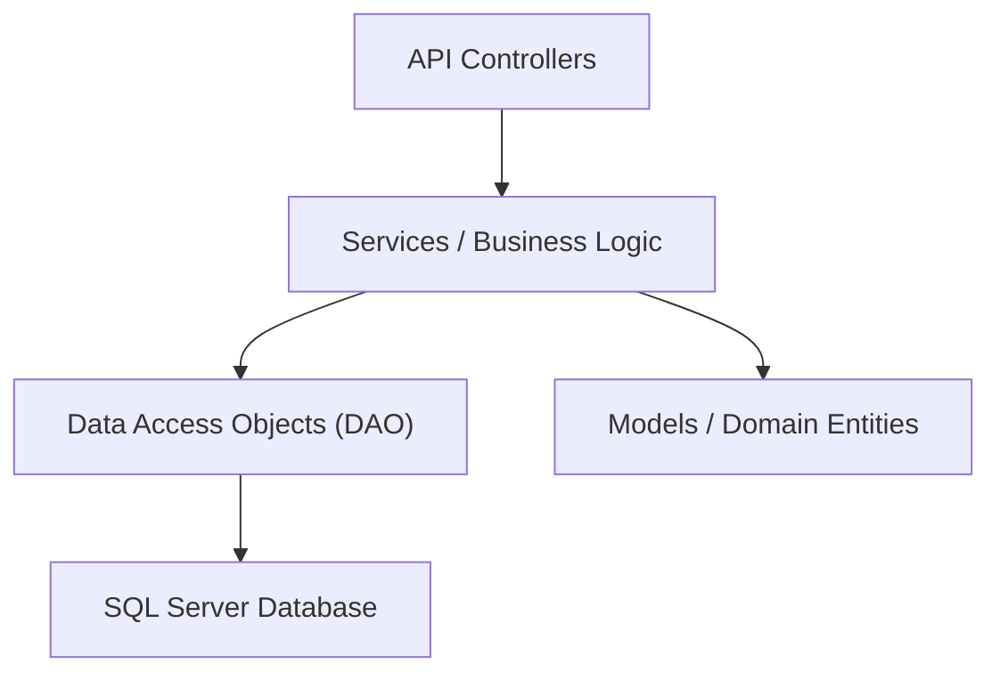

# 🏦 ATM Backend API


> **Sistema bancário robusto e seguro desenvolvido com arquitetura limpa e práticas modernas de Engenharia de Software.**

## 📖 Visão Geral

O **ATM Backend Api** é o núcleo de um sistema Multibanco moderno. Projetado para suportar operações financeiras críticas com alta confiabilidade, o sistema implementa autenticação segura, gestão de contas e transações em tempo real.

O projeto segue estritamente os princípios de **Programação Orientada a Objetos (POO)** e **Arquitetura em Camadas**, garantindo manutenibilidade, escalabilidade e facilidade de testes.

## 🏗️ Arquitetura e Design

O sistema foi construído sobre uma arquitetura em camadas para garantir a separação de responsabilidades:



### Principais Padrões Utilizados
*   **Repository Pattern (DAO):** Abstração do acesso a dados (`GenericDao<T>`), permitindo trocas fáceis de fonte de dados e testes simplificados.
*   **DTO (Data Transfer Object):** Separação entre os modelos de domínio e os dados expostos publicamente na API.
*   **Dependency Injection:** Gestão de dependências nativa do .NET 8 para acoplamento fraco.
*   **Strategy/Polymorphism:** Implementação polimórfica para diferentes tipos de transações (Depósito, Levantamento).

## ✨ Funcionalidades Chave

*   **🔐 Autenticação Segura:** Sistema de Login via JWT (JSON Web Tokens) com **Hashing de senhas via BCrypt**.
*   **💳 Gestão de Cartões:** Criação, associação a contas e validação de propriedade.
*   **� Imagem de Perfil:** Armazenamento e gestão de imagens de perfil (Base64).
*   **�💰 Operações Bancárias:**
    *   **Consultar Saldo:** Visualização em tempo real.
    *   **Levantamentos & Depósitos:** Com validação estrita de fundos e valores.
    *   **Transferências:** Movimentação entre contas segura e atómica.
*   **🛡️ Segurança:** Criptografia de senhas (BCrypt), validação de inputs e proteção contra saldos negativos.
*   **🐳 Docker Ready:** Ambiente completo (App + BD) pronto a rodar com um comando.

---

## 🚀 Como Executar

### Pré-requisitos
*   **Docker Desktop** (Recomendado)
*   *Ou* .NET 8 SDK + SQL Server LocalDB

### Opção 1: Via Docker (Recomendado)
A forma mais rápida de iniciar. Sobe a API e o SQL Server automaticamente.

```bash
docker-compose up --build -d
```
*   **Swagger API:** [http://localhost:8080/swagger](http://localhost:8080/swagger)

### Opção 2: Desenvolvimento Local
1.  Configure a Connection String no `appsettings.json`.
2.  Aplique as migrações:
    ```bash
    dotnet ef database update
    ```
3.  Execute o projeto:
    ```bash
    dotnet run
    ```


---

## 📚 Documentação da API

A API segue o padrão RESTful e responde em JSON. Todos os endpoints protegidos (🔒) requerem autenticação via JWT.

> ⚠️ **Autenticação:** Para endpoints protegidos (🔒), inclua o cabeçalho: `Authorization: Bearer <seu_token>`

---

### 🔐 Autenticação

#### `POST /multibanco/auth/login`
Autentica o utilizador e retorna um Token JWT válido por 24 horas.

**Request Body:**
```json
{
  "username": "admin",
  "password": "admin123"
}
```

**Response (200 OK):**
```json
{
  "client": {
    "id": 1,
    "username": "admin"
  },
  "token": "eyJhbGciOiJIUzI1NiIsInR5cCI6IkpXVCJ9..."
}
```

**Errors:**
- `404 Not Found` - Utilizador ou senha inválidos

---

### 👤 Clientes (`/multibanco/client`)

#### `POST /multibanco/client` (Registo)
Cria um novo cliente com conta e cartão associados.

**Request Body:**
```json
{
  "username": "joao_silva",
  "password": "senha_segura123",
  "bankId": 1,
  "cardNumber": "123456789012",
  "profileImage": "data:image/png;base64,iVBORw0KGgoAAAANSUhEUgAAAAEAAAABCAYAAAAfFcSJAAAADUlEQVR42mP8z8BQDwAEhQGAhKmMIQAAAABJRU5ErkJggg==" // Opcional
}
```

**Validações:**
- `username`: 3-50 caracteres, deve ser único
- `password`: 4-100 caracteres (será encriptada com BCrypt)
- `bankId`: ID válido de banco existente
- `cardNumber`: Exatamente 12 dígitos

**Response:** `201 Created`

---

#### `GET /multibanco/client` 🔒
Lista todos os clientes registados.

**Response (200 OK):**
```json
[
  {
    "id": 1,
    "username": "admin",
    "password": "$2a$11$..." // Hash BCrypt
  }
]
```

---

#### `GET /multibanco/client/{id}` 🔒
Obtém detalhes de um cliente específico.

**Response (200 OK):**
```json
{
  "id": 1,
  "username": "admin",
  "password": "$2a$11$...",
  "profileImage": "data:image/png;base64,iVBORw0KG..."
}
```

**Errors:**
- `404 Not Found` - Cliente não encontrado

---

#### `PUT /multibanco/client/{id}` 🔒
Atualiza os dados de um cliente.

**Request Body:**
```json
{
  "id": 1,
  "username": "novo_username",
  "password": "$2a$11$..." // Hash BCrypt
}
```

**Response:** `204 No Content`

**Errors:**
- `400 Bad Request` - ID no URL não corresponde ao body
- `404 Not Found` - Cliente não encontrado

---

#### `DELETE /multibanco/client/{id}` 🔒
Remove um cliente do sistema.

**Response (200 OK):**
```json
{
  "id": 1,
  "username": "admin",
  "password": "$2a$11$..."
}
```

**Errors:**
- `404 Not Found` - Cliente não encontrado

---

#### `POST /multibanco/client/{id}/image` �
Atualiza a imagem de perfil do cliente.

**Request Body:**
```json
{
  "profileImage": "data:image/jpeg;base64,/9j/4AAQSkZJRg..."
}
```

**Response:** `200 OK`

---

#### `GET /multibanco/client/{id}/image` 🔒
Obtém a imagem de perfil do cliente.

**Response (200 OK):**
```json
{
  "profileImage": "data:image/jpeg;base64,/9j/4AAQSkZJRg..."
}
```

---

#### `DELETE /multibanco/client/{id}/image` 🔒
Remove a imagem de perfil do cliente.

**Response:** `204 No Content`

---

### �💳 Cartões (`/multibanco/card`)

#### `GET /multibanco/card/{id}` 🔒
Obtém detalhes de um cartão, incluindo saldo.

**Response (200 OK):**
```json
{
  "id": 1,
  "cardNumber": "123456789012",
  "balance": 1000.50,
  "accountId": 1,
  "bankId": 1
}
```

**Errors:**
- `404 Not Found` - Cartão não encontrado

---

#### `POST /multibanco/card/add` 🔒
Cria um novo cartão associado à conta do utilizador autenticado e a um banco.

**Request Body:**
```json
{
  "bankId": 1,
  "cardNumber": "987654321098"
}
```

**Validações:**
- `cardNumber`: Exatamente 12 dígitos, deve ser único
- `bankId`: Deve existir na base de dados

**Response:** `201 Created`

---

#### `GET /listAccountCards` 🔒
Lista todos os cartões associados à conta do utilizador autenticado.

**Response (200 OK):**
```json
[
  {
    "id": 1,
    "cardNumber": "123456789012",
    "balance": 1000.50,
    "accountId": 1,
    "bankId": 1
  },
  {
    "id": 2,
    "cardNumber": "987654321098",
    "balance": 500.00,
    "accountId": 1,
    "bankId": 2
  }
]
```

---

### 💰 Transações (`/multibanco/transaction`)

O endpoint de transações é **polimórfico** e suporta 4 tipos de operações diferentes, determinadas pelos campos enviados no request body.

#### `PUT /multibanco/transaction` 🔒
Executa operações bancárias: **Depósito**, **Levantamento**, **Transferência** ou **Pagamento de Serviços**.

---

#### 📥 **Operação 1: Depósito (Deposit)**
Deposita dinheiro numa conta através do número do cartão.

**Request Body:**
```json
{
  "scrId": -1,
  "dstCardNumber": "123456789012",
  "amount": 100.00
}
```

**Lógica de Identificação:**
- `scrId` = `-1` → Indica depósito
- `dstCardNumber` → Cartão de destino (obrigatório)
- `amount` → Valor a depositar (0.01 - 1,000,000)

**Response:** `204 No Content`

**Efeito:** Aumenta o saldo da conta associada ao cartão de destino.

---

#### 📤 **Operação 2: Levantamento (Withdraw)**
Levanta dinheiro de um cartão (ATM Withdraw).

**Request Body:**
```json
{
  "scrId": 1,
  "dstCardNumber": "",
  "amount": 50.00
}
```

**Lógica de Identificação:**
- `scrId` → ID do cartão de origem (obrigatório, > 0)
- `dstCardNumber` → Vazio ou null
- `amount` → Valor a levantar

**Validações:**
- Saldo suficiente na conta
- Valor positivo

**Response:** `204 No Content`

**Efeito:** Diminui o saldo da conta associada ao cartão de origem.

---

#### 🔄 **Operação 3: Transferência (Transfer)**
Transfere dinheiro entre dois cartões/contas.

**Request Body:**
```json
{
  "scrId": 1,
  "dstCardNumber": "987654321098",
  "amount": 200.00
}
```

**Lógica de Identificação:**
- `scrId` → ID do cartão de origem (obrigatório, > 0)
- `dstCardNumber` → Número do cartão de destino (obrigatório, não vazio)
- `amount` → Valor a transferir

**Validações:**
- Saldo suficiente no cartão de origem
- Ambos os cartões devem existir
- Valor positivo

**Response:** `204 No Content`

**Efeito:** 
- Diminui saldo da conta de origem
- Aumenta saldo da conta de destino
- Operação **atómica** (rollback automático em caso de erro)

---

#### 💡 **Operação 4: Pagamento de Serviços (Service Payment)**
Paga serviços (água, luz, internet, etc.) usando Entidade + Referência.

**Request Body:**
```json
{
  "scrId": 1,
  "dstCardNumber": "",
  "amount": 75.50,
  "entity": 10001,
  "reference": "0000000001"
}
```

**Lógica de Identificação:**
- `scrId` → ID do cartão de origem (obrigatório, > 0)
- `dstCardNumber` → Vazio ou null
- `entity` → Código da entidade (ex: 10001 = Eletricidade)
- `reference` → Referência do serviço (10 dígitos)
- `amount` → Valor a pagar

**Serviços Disponíveis:**
| Entity | Reference    | Serviço              |
|--------|--------------|----------------------|
| 10001  | 0000000001   | Electricity Bill     |
| 10002  | 0000000002   | Water Bill           |
| 10003  | 0000000003   | Internet Bill        |
| 10004  | 0000000004   | Phone Bill           |
| 10005  | 0000000005   | Gas Bill             |
| 10006  | 0000000006   | Insurance Payment    |
| 10007  | 0000000007   | TV Subscription      |
| 10008  | 0000000008   | Other Service        |

**Validações:**
- Entidade + Referência devem existir no catálogo
- Saldo suficiente
- Valor positivo

**Response:** `204 No Content`

**Efeito:** Diminui saldo da conta e regista transação com descrição do serviço.

---

#### `GET /multibanco/transaction` 🔒
Lista todas as transações registadas no sistema.

**Response (200 OK):**
```json
[
  {
    "id": 1,
    "type": "Transfer",
    "description": "Account Transfer",
    "amount": 200.00,
    "sorceCardId": 1,
    "destinyCardId": 2,
    "timestamp": "2026-01-19T18:30:00Z"
  },
  {
    "id": 2,
    "type": "Withdraw",
    "description": "Electricity Bill",
    "amount": 75.50,
    "sorceCardId": 1,
    "destinyCardId": null,
    "timestamp": "2026-01-19T18:35:00Z"
  }
]
```

---

### 🏦 Bancos (`/api/bank`)

#### `GET /api/bank`
Lista todos os bancos disponíveis no sistema.

**Response (200 OK):**
```json
[
  {
    "id": 1,
    "name": "Banco Português",
    "code": "0001"
  },
  {
    "id": 2,
    "name": "Caixa Geral",
    "code": "0002"
  }
]
```

---

### ⚠️ Tratamento de Erros

Todos os endpoints utilizam **Global Exception Middleware** para tratamento consistente de erros:

**Exemplo de Erro (400 Bad Request):**
```json
{
  "message": "Insufficient funds.",
  "timestamp": "2026-01-19T18:40:00Z"
}
```

**Exemplo de Erro (404 Not Found):**
```json
{
  "message": "Source card with ID 999 not found.",
  "timestamp": "2026-01-19T18:40:00Z"
}
```

**Códigos de Status Comuns:**
- `200 OK` - Operação bem-sucedida (com body)
- `201 Created` - Recurso criado com sucesso
- `204 No Content` - Operação bem-sucedida (sem body)
- `400 Bad Request` - Validação falhou ou dados inválidos
- `401 Unauthorized` - Token JWT ausente ou inválido
- `404 Not Found` - Recurso não encontrado
- `500 Internal Server Error` - Erro interno do servidor

---

## ✅ Estado do Projeto (Roadmap)

### 1. Core & POO
- [x] **POO Avançado**: Herança (`Model`), Encapsulamento e Abstração.
- [x] **Persistência**: Entity Framework Core com SQL Server.
- [x] **Validações de Negócio**: Impedir saldos negativos e operações inválidas.

### 2. Funcionalidades Bancárias
- [x] **Consultar Saldo**: Via endpoint de cartão.
- [x] **Levantar / Depositar**: Implementado com validações de segurança.
- [x] **Transferências**: Funcional entre contas.
- [ ] **Polimorfismo (Refatoração)**: Migrar lógica de `IFs` para Classes de Transação.

### 3. Segurança & Qualidade
- [x] **JWT Auth**: Proteção total de endpoints sensíveis.
- [x] **Segurança de Dados**: Hashing de senhas utilizando BCrypt.Net.
- [x] **Gestão de Perfil**: Upload e armazenamento de imagens de perfil.

- [x] **Dockerização**: Ambiente isolado e reprodutível.

---

<div align="center">
  <h3>Projeto de Programação Orientada a Objetos (POO)</h3>
  <p>Desenvolvido por:</p>
  <p><strong>Diogo Pimenta</strong> e <strong>Olavo</strong></p>
</div>
