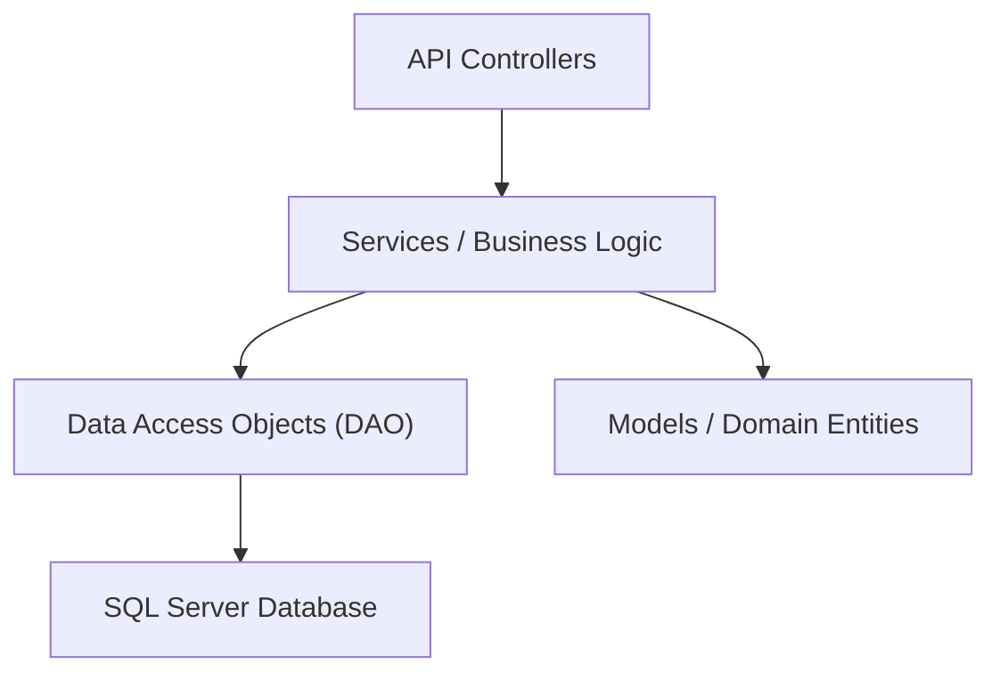

# 🏦 ATM Backend API


> **Sistema bancário robusto e seguro desenvolvido com arquitetura limpa e práticas modernas de Engenharia de Software.**

## 📖 Visão Geral

O **ATM Backend Api** é o núcleo de um sistema Multibanco moderno. Projetado para suportar operações financeiras críticas com alta confiabilidade, o sistema implementa autenticação segura, gestão de contas e transações em tempo real.

O projeto segue estritamente os princípios de **Programação Orientada a Objetos (POO)** e **Arquitetura em Camadas**, garantindo manutenibilidade, escalabilidade e facilidade de testes.

## 🏗️ Arquitetura e Design

O sistema foi construído sobre uma arquitetura em camadas para garantir a separação de responsabilidades:



### Principais Padrões Utilizados
*   **Repository Pattern (DAO):** Abstração do acesso a dados (`GenericDao<T>`), permitindo trocas fáceis de fonte de dados e testes simplificados.
*   **DTO (Data Transfer Object):** Separação entre os modelos de domínio e os dados expostos publicamente na API.
*   **Dependency Injection:** Gestão de dependências nativa do .NET 8 para acoplamento fraco.
*   **Strategy/Polymorphism:** Implementação polimórfica para diferentes tipos de transações (Depósito, Levantamento).

## ✨ Funcionalidades Chave

*   **🔐 Autenticação Segura:** Sistema de Login via JWT (JSON Web Tokens).
*   **💳 Gestão de Cartões:** Criação, associação a contas e validação de propriedade.
*   **💰 Operações Bancárias:**
    *   **Consultar Saldo:** Visualização em tempo real.
    *   **Levantamentos & Depósitos:** Com validação estrita de fundos e valores.
    *   **Transferências:** Movimentação entre contas segura e atómica.
*   **🛡️ Segurança:** Validação de inputs, proteção contra saldos negativos e tratamento de exceções.
*   **🐳 Docker Ready:** Ambiente completo (App + BD) pronto a rodar com um comando.

---

## 🚀 Como Executar

### Pré-requisitos
*   **Docker Desktop** (Recomendado)
*   *Ou* .NET 8 SDK + SQL Server LocalDB

### Opção 1: Via Docker (Recomendado)
A forma mais rápida de iniciar. Sobe a API e o SQL Server automaticamente.

```bash
docker-compose up --build -d
```
*   **Swagger API:** [http://localhost:8080/swagger](http://localhost:8080/swagger)

### Opção 2: Desenvolvimento Local
1.  Configure a Connection String no `appsettings.json`.
2.  Aplique as migrações:
    ```bash
    dotnet ef database update
    ```
3.  Execute o projeto:
    ```bash
    dotnet run
    ```


---

## 📚 Documentação da API

A API segue o padrão RESTful e responde em JSON. Abaixo estão os detalhes dos principais endpoints.

#### 🔐 Autenticação (`/multibanco/auth`)
| Método | Endpoint | Descrição | Request Body |
| :--- | :--- | :--- | :--- |
| `POST` | `/login` | Autentica o utilizador e retorna um Token JWT. | `{ "username": "...", "password": "..." }` |

#### 👤 Clientes (`/multibanco/client`)
| Método | Endpoint | Auth | Descrição |
| :--- | :--- | :--- | :--- |
| `POST` | `/` | ❌ | **Registo**. Cria um novo cliente. Body: `{ "username": "...", "password": "..." }` |
| `GET` | `/` | ✅ | Lista todos os clientes. |
| `GET` | `/{id}` | ✅ | Obtém detalhes de um cliente específico. |
| `PUT` | `/{id}` | ✅ | Atualiza os dados de um cliente. |
| `DELETE` | `/{id}` | ✅ | Remove um cliente do sistema. |

#### 💳 Cartões (`/multibanco/card`)
| Método | Endpoint | Auth | Descrição |
| :--- | :--- | :--- | :--- |
| `GET` | `/{id}` | ✅ | Obtém detalhes de um cartão (inclui saldo). |
| `POST` | `/add/{accountId}/{bankId}` | ✅ | Cria um novo cartão associado a uma conta e banco. |
| `GET` | `/listAccountCards/{accountId}` | ✅ | Lista todos os cartões de uma conta. |

#### 💰 Transações (`/multibanco/transaction`)
| Método | Endpoint | Auth | Descrição | Request Body (Exemplo) |
| :--- | :--- | :--- | :--- | :--- |
| `PUT` | `/` | ✅ | Executa Depósito, Levantamento ou Transferência. | `{ "scrId": 1, "dstCardNumber": "", "amount": 50 }` |

> ⚠️ **Nota Importante:** Para endpoints protegidos (✅), deve enviar o cabeçalho: `Authorization: Bearer <seu_token>`.

---

## ✅ Estado do Projeto (Roadmap)

### 1. Core & POO
- [x] **POO Avançado**: Herança (`Model`), Encapsulamento e Abstração.
- [x] **Persistência**: Entity Framework Core com SQL Server.
- [x] **Validações de Negócio**: Impedir saldos negativos e operações inválidas.

### 2. Funcionalidades Bancárias
- [x] **Consultar Saldo**: Via endpoint de cartão.
- [x] **Levantar / Depositar**: Implementado com validações de segurança.
- [x] **Transferências**: Funcional entre contas.
- [ ] **Polimorfismo (Refatoração)**: Migrar lógica de `IFs` para Classes de Transação.

### 3. Segurança & Qualidade
- [x] **JWT Auth**: Proteção total de endpoints sensíveis.

- [x] **Dockerização**: Ambiente isolado e reprodutível.

---

<div align="center">
  <h3>Projeto de Programação Orientada a Objetos (POO)</h3>
  <p>Desenvolvido por:</p>
  <p><strong>Diogo Pimenta</strong> e <strong>Olavo</strong></p>
</div>
